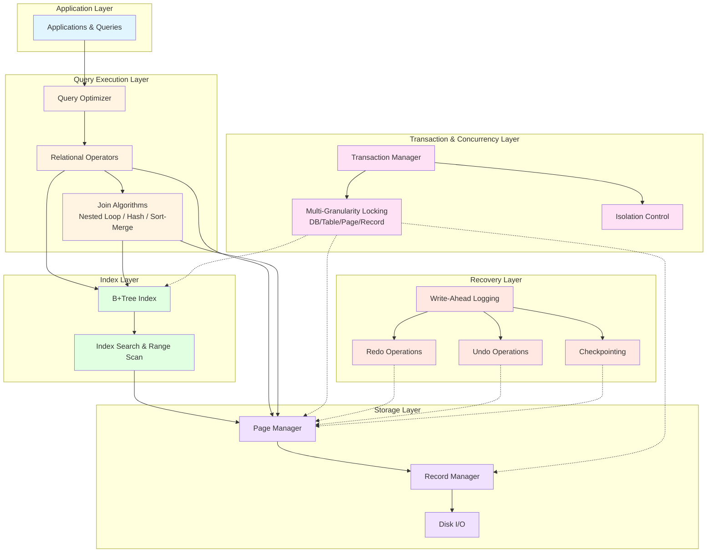

# Relational Database Engine

This project extends a basic database system of CS186 that initially supports only simple, serial transaction execution. 
On top of this core implementation, all required features have been added, 
including B+ tree indices, optimized join algorithms, query optimization techniques, 
multigranularity locking to enable concurrent transactions, and a database recovery mechanism.

---
## Table of Contents
- [Relational Database Engine](#relational-database-engine)
  - [Table of Contents](#table-of-contents)
  - [Overview](#overview)
  - [System Architecture](#system-architecture)
    - [Architecture Diagram](#architecture-diagram)
  - [Implemented Features](#implemented-features)
  - [B+ Tree Index](#b-tree-index)
  - [Join Algorithms and Query Optimization](#join-algorithms-and-query-optimization)
  - [Concurrency Control](#concurrency-control)
  - [Recovery](#recovery)
  - [Limitations \& Future Work](#limitations--future-work)

---

## Overview

This project is based on a minimal relational database implementation that supports
executing simple transactions in serial. The system was incrementally extended to support
key features expected in modern database systems, with a focus on correctness,
performance, and modular design.

The primary goal of this project is to explore the design and implementation of core
database internals, including storage indexing, query execution strategies, transaction
concurrency, and crash recovery.

---

## System Architecture

The system is composed of the following core components:

- **Storage Layer**: Manages pages, records, and disk I/O.
- **Index Layer**: Provides clustered B+Tree indices for efficient record access.
- **Query Execution Layer**: Implements relational operators and join algorithms.
- **Transaction & Concurrency Layer**: Handles locking and transaction isolation.
- **Recovery Layer**: Ensures durability and correctness in the presence of failures.

### Architecture Diagram

---

## Implemented Features

- Clustered B+Tree indexing
- Multiple join algorithms with cost-based selection
- Query optimization for multi-table joins
- Multi-granularity locking for concurrent transactions
- ARIES-style logging and crash recovery

---

## B+ Tree Index

- Implemented a **clustered B+Tree index** to support efficient point lookups and range scans.
- Supports core index operations including search, insert, and delete.
- Handles node split and merge operations to maintain tree balance.
- Integrated with the query execution engine to optimize index-based access paths.

*(You may add implementation details such as page layout, fanout, or persistence strategy here.)*

---

## Join Algorithms and Query Optimization

The following join algorithms are implemented and evaluated:

- **Nested Loop Join**
- **Hash Join**
- **Sort-Merge Join**

Through the design and implementation of these algorithms, 
I gained a deep understanding of their characteristics and how they affect performance under different workloads.
Each algorithm is selected based on its performance behavior across varying data sizes and join predicates. 
Through benchmarking, **sort-merge join** was chosen for multi-table join workloads, reducing I/O operations from **603 to 8** compared to the
baseline implementation.

---

## Concurrency Control

- Designed a **multi-granularity locking protocol** spanning database, table, page, and record levels.
- Implemented intention locks (**IS, IX**) alongside shared and exclusive locks (**S, X**).
- Defined lock compatibility matrices and lock escalation/propagation rules.
- Ensures correctness and isolation for concurrently executing transactions.

---

## Recovery

- Implemented **ARIES-style write-ahead logging (WAL)**.
- Supports redo and undo during crash recovery.
- Designed a checkpointing mechanism to bound recovery time.
- Correctly restores database state after system failures.

---

## Limitations & Future Work

- Cost-based query optimization can be further improved. 
- Support for additional isolation levels (e.g., MVCC). 
- Enhanced recovery performance under high-concurrency workloads.
