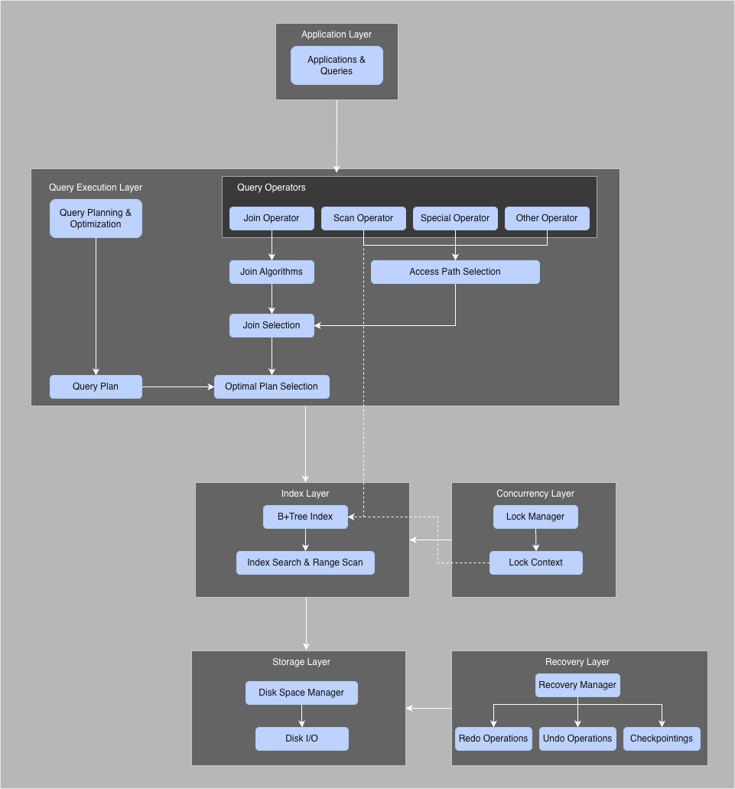

# Relational Database Engine

[//]: # (![Database Icon]&#40;images/derpydb-small.jpg&#41;)

This project extends a basic database system of CS186 that initially supports only simple, serial transaction execution. 
On top of this core implementation, all required features have been added, 
including B+ tree indices, optimized join algorithms, query optimization techniques, 
multigranularity locking to enable concurrent transactions, and a database recovery mechanism.

---
## Table of Contents
- [Relational Database Engine](#relational-database-engine)
  - [Table of Contents](#table-of-contents)
  - [Overview](#overview)
  - [System Architecture](#system-architecture)
    - [Architecture Diagram](#architecture-diagram)
  - [Implemented Features](#implemented-features)
  - [B+ Tree Index](#b-tree-index)
  - [Join Algorithms and Query Optimization](#join-algorithms-and-query-optimization)
  - [Concurrency Control](#concurrency-control)
  - [Recovery](#recovery)
  - [Limitations \& Future Work](#limitations--future-work)

---

## Overview

This project is based on a minimal relational database implementation that supports
executing simple transactions in serial. The system was incrementally extended to support
key features expected in modern database systems, with a focus on correctness,
performance, and modular design.

The primary goal of this project is to explore the design and implementation of core
database internals, including storage indexing, query execution strategies, transaction
concurrency, and crash recovery.

---

## System Architecture

The system is composed of the following core components:

- **Storage Layer**: Manages pages, records, and disk I/O.
- **Index Layer**: Provides clustered B+Tree indices for efficient record access.
- **Query Execution Layer**: Implements relational operators and join algorithms.
- **Transaction & Concurrency Layer**: Handles locking and transaction isolation.
- **Recovery Layer**: Ensures durability and correctness in the presence of failures.

### Architecture Diagram

---

## Implemented Features

- Clustered B+Tree indexing
- Multiple join algorithms with cost-based selection
- Query optimization for multi-table joins
- Multi-granularity locking for concurrent transactions
- ARIES-style logging and crash recovery

---

## B+ Tree Index

- Implemented a **clustered B+Tree index** to support efficient point lookups and range scans.
- Supports core index operations including search, insert, and delete.
- Handles node split and merge operations to maintain tree balance.
- Integrated with the query execution engine to optimize index-based access paths.

---

## Join Algorithms and Query Optimization

The following join algorithms are implemented and evaluated:

- **Nested Loop Join**
- **Hash Join**
- **Sort-Merge Join**

Through the design and implementation of these algorithms, 
I gained a deep understanding of their characteristics and how they affect performance under different workloads.
Each algorithm is selected based on its performance behavior across varying data sizes and join predicates. 
Through benchmarking, **sort-merge join** was chosen for multi-table join workloads, reducing I/O operations from **603 to 8** compared to the
baseline implementation.

### Query Optimization

The query optimizer uses a **cost-based, dynamic programming approach** to identify
efficient execution plans.

For single-table access, the optimizer selects the lowest-cost access path by
comparing **sequential scans** with eligible **index scans**, pushing down all
single-table selection predicates whenever possible.

For joins, the optimizer incrementally builds **left-deep join plans** using
explicit join predicates, evaluates available join algorithms, and excludes cartesian
products.

The final execution plan is selected globally and completed by appending group-by and
projection operators.

---

## Concurrency Control

Designed and implemented a **multi-granularity concurrency control subsystem** based on
strict two-phase locking (2PL) to support safe concurrent execution.

- Implemented **LockManager** with support for lock acquisition, release, promotion, 
   and atomic acquire-and-release, and built hierarchical 
  **LockContext** abstractions to enforce multi-granularity locking constraints 
  across database, table, page, and record levels.
- Implemented **intent locks (IS, IX)** alongside shared and exclusive locks (**S, X**),
  including correct handling of **SIX locks**, and lock propagation rules.
- Integrated **strict two-phase locking** by acquiring locks during query execution and
  releasing all locks only at transaction completion, ensuring serializability.

Together, these components provide correctness, isolation, and improved concurrency while
maintaining modular separation between locking, execution, and storage layers.

---

## Recovery

Implemented a **ARIES-style recovery manager** to ensure atomicity and durability
across system crashes.

- Reconstructed the **transaction table** and **dirty page table** during the analysis
  phase by scanning the log from the most recent checkpoint and correctly handling fuzzy
  checkpoint semantics.
- Implemented **redo logic with pageLSN validation**, reapplying only necessary operations
  from the lowest recLSN to avoid redundant I/O.
- Built a **priority-based undo mechanism** that rolls back incomplete transactions in
  descending LSN order using **compensation log records (CLRs)**.

These mechanisms restore the database to a consistent state after failures
while minimizing recovery overhead.

---

## Limitations & Future Work

- Cost-based query optimization can be further improved. 
- Support for additional isolation levels (e.g., MVCC). 
- Enhanced recovery performance under high-concurrency workloads.
